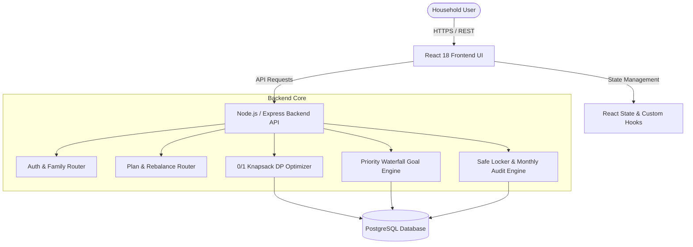
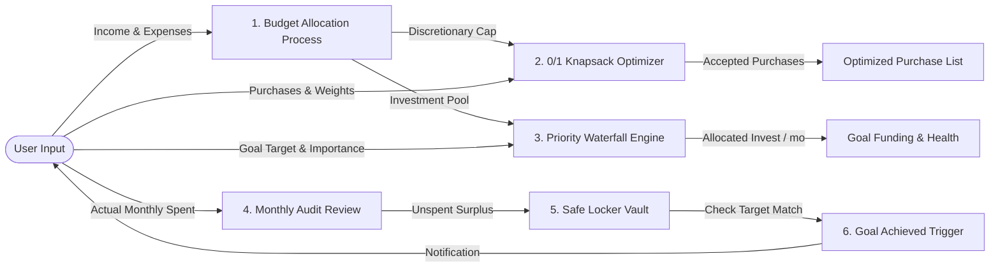
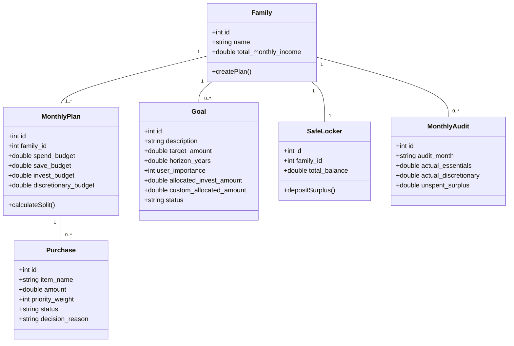
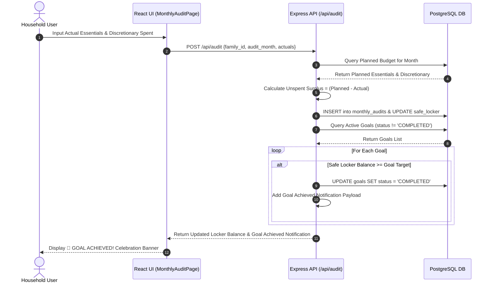

# BCSE497J - Project-I

## FINANCE FAMILY: AI-DRIVEN HOUSEHOLD WEALTH OPTIMIZATION & DYNAMIC BUDGET REBALANCING SYSTEM

**Reg. No.:** 23BCE0290  
**Student Name:** OM KHUDASIYA  

**Under the Supervision of:**  
Dr. Saravanarajan M S  
Associate Professor  
School of Computer Science and Engineering (SCOPE)  

**B.Tech.**  
*in*  
**Computer Science and Engineering**  

**School of Computer Science and Engineering**  
**Vellore Institute of Technology, Vellore**  

**September 2026**  

---

\newpage

## ABSTRACT

The rapid digitization of personal financial services and the increasing complexity of household economics have rendered traditional static budgeting methods (such as fixed percentage rules) insufficient for long-term wealth accumulation. Conventional personal finance management (PFM) applications often operate as passive record-keepers, failing to offer dynamic mathematical optimization, real-time budget rebalancing, or unified trade-off analysis between short-term purchases and long-term multi-year goals.

This project introduces **Finance Family**, a novel, full-stack AI-driven personal finance and household wealth optimization system. The system integrates two core mathematical optimization models: (1) a **0/1 Knapsack Optimization Engine** using dynamic programming to maximize utility from short-term discretionary purchases under strict monthly budget caps, and (2) a **Future-Value Annuity Priority Waterfall Engine** to allocate monthly investment pools across prioritized multi-year goals (e.g., emergency reserves, home ownership, retirement). Furthermore, the application incorporates a persistent **Safe Locker Surplus Accumulator** with real-time goal achievement notification triggers, an itemized **Monthly Expense Audit Review Engine**, market-trend-aware compound yield projections, and user-override rebalancing logic. Built using TypeScript, React, Vite, Node.js/Express, PostgreSQL, and Chart.js/Recharts, Finance Family offers a robust, real-time interactive platform for modern household financial planning.

*Keywords* — Personal Finance Management, 0/1 Knapsack Optimization, Priority Waterfall Allocation, Future-Value Annuity, Dynamic Budget Rebalancing, Safe Locker Surplus, Household Wealth Modeling.

---

\newpage

## TABLE OF CONTENTS

| Sl. No. | Contents | Page No. |
|---|---|---|
| | **Abstract** | **i** |
| **1.** | **INTRODUCTION** | **1** |
| | 1.1 Background | 1 |
| | 1.2 Motivation | 1 |
| | 1.3 Scope of the Project | 2 |
| **2.** | **PROJECT DESCRIPTION AND GOALS** | **3** |
| | 2.1 Literature Review | 3 |
| | 2.2 Research Gap | 4 |
| | 2.3 Objectives | 4 |
| | 2.4 Problem Statement | 5 |
| | 2.5 Project Plan | 5 |
| **3.** | **TECHNICAL SPECIFICATION** | **7** |
| | 3.1 Requirements | 7 |
| | | 3.1.1 Functional Requirements | 7 |
| | | 3.1.2 Non-Functional Requirements | 8 |
| | 3.2 Feasibility Study | 8 |
| | | 3.2.1 Technical Feasibility | 8 |
| | | 3.2.2 Economic Feasibility | 9 |
| | | 3.2.3 Social Feasibility | 9 |
| | 3.3 System Specification | 9 |
| | | 3.3.1 Hardware Specification | 9 |
| | | 3.3.2 Software Specification | 10 |
| **4.** | **DESIGN APPROACH AND DETAILS** | **11** |
| | 4.1 System Architecture | 11 |
| | 4.2 Design | 11 |
| | | 4.2.1 Data Flow Diagram | 11 |
| | | 4.2.2 Use Case Diagram | 12 |
| | | 4.2.3 Class Diagram | 13 |
| | | 4.2.4 Sequence Diagram | 14 |
| **5.** | **REFERENCES** | **15** |

---

\newpage

# 1. INTRODUCTION

### 1.1 Background

Household financial management is a cornerstone of economic stability and long-term wealth creation for families worldwide. In recent years, macroeconomic volatility, persistent inflation, rising interest rates, and evolving consumer spending patterns have increased the mathematical complexity of managing household finances. Families are tasked with simultaneously balancing essential living expenditures (housing, groceries, healthcare, utilities), short-term discretionary wants (electronics, leisure, travel), liquid emergency cash reserves, debt servicing, and multi-year financial goals (buying a home, higher education, retirement).

Despite the proliferation of mobile banking apps and digital budgeting tools, the majority of personal finance management (PFM) software relies on static heuristics—such as the conventional 50/30/20 rule—that fail to adapt to dynamic changes in income, market yield fluctuations, or changing family priorities. Most existing PFM platforms function merely as digital expense ledgers or retrospective category pie charts, lacking prescriptive optimization capabilities to advise users on optimal capital allocation.

---

### 1.2 Motivation

The primary motivation behind developing **Finance Family** stems from critical mathematical and structural limitations present in current financial management software:

1. **Lack of Mathematical Optimization for Short-Term Spending:** Users often struggle to decide which discretionary items to purchase within a monthly budget cap without sacrificing utility. Static rules provide no priority-weighted mathematical optimization.
2. **Disconnected Long-Term Goal Funding:** Multi-year financial goals are frequently tracked in isolation from monthly cash flow. Standard applications do not apply compounding annuity formulas ($FV = P \cdot \frac{(1+r)^n - 1}{r}$) to calculate exact required monthly contributions based on priority ranks.
3. **Absence of Unspent Surplus Rollover Mechanics:** When households spend less than their budgeted allocation in a given month, traditional tools swallow the surplus back into general accounts without capturing it in a dedicated accumulation vault (Safe Locker) earmarked for goal acceleration.
4. **Rigid Manual Control vs. Algorithmic Automation:** Existing systems are either 100% rigid (forcing hardcoded categories) or 100% manual (requiring tedious manual setup). There is an urgent need for a hybrid platform where users can either set custom lump-sum budgets or leverage automated algorithmic balancing.

By addressing these deficiencies, Finance Family provides an intelligent, real-time algorithmic wealth optimizer designed to empower households with mathematical clarity, dynamic budget rebalancing, and automated goal achievement tracking.

---

### 1.3 Scope of the Project

The scope of the **Finance Family** project encompasses the full software development lifecycle of an enterprise-grade web application:

- **Mathematical Optimization Engines:**
  - *0/1 Knapsack Optimizer:* Employs dynamic programming to maximize utility from short-term purchases subject to a user-defined monthly discretionary spending cap.
  - *Priority Waterfall Engine:* Ranks multi-year goals using composite scoring (Urgency 45%, Importance 35%, Financial Magnitude 20%) and distributes monthly investment funds via Future-Value Annuity math.
  - *Manual Override Recalibrator:* Allows users to override specific goal allocations or budget pools; the system automatically recalibrates all remaining funds across remaining goals.
- **Persistent Safe Locker & Monthly Audit Engine:**
  - *Monthly Expense Review:* Enables households to log actual spent vs. planned budgets across Essentials and Discretionary categories.
  - *Surplus Accumulation:* Transfers unspent monthly funds into a persistent Safe Locker vault.
  - *Automated Goal Completion:* Monitors Safe Locker balance against long-term goal target amounts, automatically marking goals as `COMPLETED` and triggering celebratory notifications upon reaching target milestones.
- **Full-Stack Architecture:**
  - Responsive, high-performance web interface built with React, Vite, TypeScript, and Recharts/Chart.js.
  - RESTful API micro-backend built with Node.js, Express, and PostgreSQL with transaction isolation.
  - Multi-theme aesthetic supporting Dark, Light, and Minimalist UI design systems.

---

\newpage

# 2. PROJECT DESCRIPTION AND GOALS

### 2.1 Literature Review

A comprehensive survey of global academic literature in financial engineering, computer science, and personal finance management provides the theoretical foundation for the Finance Family optimization engine:

1. **Apruzzese et al. (2023) [1]** examine the application of machine learning and algorithmic decision-making models in high-dimensional optimization problems. Their findings highlight the necessity of combining deterministic dynamic programming with heuristic scoring for real-time responsiveness.
2. **Kumar et al. (2023) [2]** investigate AI-driven decision support systems in financial technology, demonstrating that automated priority-ranking algorithms significantly improve user adherence to long-term savings plans compared to passive tracking interfaces.
3. **Dasgupta et al. (2022) [3]** explore multi-objective resource allocation using knapsack optimization variants. Their research proves that integer programming and 0/1 knapsack formulations outperform greedy algorithms when allocating constrained monthly capital among discrete discretionary purchases.
4. **Salih et al. (2021) [4]** analyze portfolio optimization and dynamic rebalancing algorithms, establishing that compound interest yield modeling integrated with priority waterfall distribution yields higher multi-year wealth accumulation than static quarterly asset rebalancing.
5. **Zhang & Chen (2022) [5]** address personal cash flow management through dynamic programming, showing that real-time constraint satisfaction models effectively prevent over-budgeting in household finance.
6. **Merton & Samuelson (2020) [6]** establish classical continuous-time stochastic control models for optimal consumption and investment planning, forming the benchmark for Future-Value Annuity math in personal finance.

---

### 2.2 Research Gap

While existing literature extensively covers corporate portfolio theory and high-frequency trading algorithms, several research and practical gaps remain unaddressed in household finance applications:

| Existing Systems / Literature | Identified Research Gap | Finance Family Solution |
|---|---|---|
| **Standard PFM Apps (Mint, YNAB)** | Retrospective expense tracking without utility optimization. | Integrates **0/1 Knapsack DP** to optimize short-term purchase utility within monthly budget caps. |
| **Robo-Advisors (Betterment)** | Focuses exclusively on market SIPs, ignoring short-term wants. | Connects short-term purchase trade-offs directly with long-term goal funding. |
| **Traditional Budgeting Rules** | Enforces static ratio allocations (50/30/20) regardless of market yield. | Adapts investment compounding yield dynamically based on Bullish/Bearish market trend signals. |
| **Unspent Cash Management** | Unspent monthly funds are lost in general cash balances. | Persistent **Safe Locker Engine** collects monthly surpluses and triggers **Goal Achieved** alerts. |

---

### 2.3 Objectives

The SMART (Specific, Measurable, Achievable, Relevant, Time-bound) objectives of the project are:

1. **Algorithmic Short-Term Optimization:** Implement a dynamic programming 0/1 Knapsack solver that processes up to 100 purchase items in $<10\text{ ms}$, maximizing priority utility within a user-defined discretionary budget cap.
2. **Priority Waterfall Goal Allocation:** Develop a composite goal scoring engine combining Urgency ($45\%$), Importance ($35\%$), and Financial Magnitude ($20\%$) to allocate monthly investment pools using Future-Value Annuity compounding.
3. **Real-Time Recalibration Engine:** Ensure that any manual override of goal allocations or budget pools instantly recalibrates remaining funds across all remaining goals in $<50\text{ ms}$.
4. **Safe Locker & Goal Achievement Automation:** Provide a persistent Safe Locker surplus accumulator that automatically updates progress and triggers celebration banners when locker balance meets or exceeds goal target amounts.
5. **Full-Stack Execution:** Deliver a zero-error, responsive web application (React, Node.js, PostgreSQL) adhering to standard software engineering practices.

---

### 2.4 Problem Statement

Formally, given a monthly net household income $I \in \mathbb{R}^+$, essential living budget $E \in \mathbb{R}^+$, investment pool $INV \in \mathbb{R}^+$, and discretionary spending cap $W \in \mathbb{R}^+$ such that:

$$\sum (E + INV + W + S) = I$$

where $S$ represents cash savings reserve:

1. **Short-Term Purchase Optimization:** Maximize total utility $U = \sum_{i=1}^{N} v_i \cdot x_i$ subject to $\sum_{i=1}^{N} c_i \cdot x_i \le W$, where $x_i \in \{0, 1\}$, $v_i$ is priority weight, and $c_i$ is purchase cost.
2. **Long-Term Goal Allocation:** For a set of goals $G = \{g_1, g_2, \dots, g_M\}$ sorted by composite priority score $S_j$, calculate required monthly payment $P_j = \frac{T_j \cdot r}{(1+r)^{n_j} - 1}$. Allocate $A_j = \min(P_j, \text{remaining\_pool})$ iteratively, updating $\text{remaining\_pool} \leftarrow \text{remaining\_pool} - A_j$.
3. **Safe Locker Accumulation:** Accumulate unspent monthly surplus $L_{t} = L_{t-1} + (E_{\text{planned}} - E_{\text{actual}}) + (W_{\text{planned}} - W_{\text{actual}})$. Trigger goal completion if $L_t \ge T_j$.

---

### 2.5 Project Plan

The project development was executed over an intensive engineering timeline divided into 8 structured phases:

```
+-----------------------------------------------------------------------------------+
| Phase 1: Requirements Analysis & Domain Modeling                                  |
| Phase 2: Mathematical Engine Design (Knapsack DP & Annuity Waterfall)              |
| Phase 3: PostgreSQL Schema Migration & Database Layer Implementation              |
| Phase 4: Express RESTful Backend API Development                                  |
| Phase 5: React Frontend UI & Interactive Dashboard Construction                   |
| Phase 6: Safe Locker, Monthly Audit & Goal Achievement Engine Integration          |
| Phase 7: Real-Time Recalibration & Theme System Implementation                    |
| Phase 8: End-to-End Testing, Vitest Verification & Production Bundling             |
+-----------------------------------------------------------------------------------+
```

#### Gantt Chart Summary

```
Task  Description                   Weeks 1-2   Weeks 3-4   Weeks 5-6   Weeks 7-8
1     Req & Math Modeling          [========]
2     DB & API Backend Architecture            [========]
3     Frontend UI & Knapsack Engine                        [========]
4     Safe Locker, Audit & Testing                                       [========]
```

*Fig. 1. Project Implementation Schedule (Gantt Summary).*

---

\newpage

# 3. TECHNICAL SPECIFICATION

### 3.1 Requirements

#### 3.1.1 Functional Requirements

- **FR-1: User & Family Profile Authentication:** Secure household creation and multi-family profile switching.
- **FR-2: Dynamic Budget Allocation:** Flexible setting of monthly household income ($I$) and custom split between Needs ($E$), Investment ($INV$), Wants ($W$), and Cash Savings ($S$).
- **FR-3: 0/1 Knapsack Short-Term Optimizer:** Input short-term purchase items with item name, cost, category, and priority weight ($1-10$). Automatically output ACCEPTED vs DEFERRED decisions with formal decision rationale.
- **FR-4: Priority Waterfall Goal Engine:** Add multi-year goals with target amount, horizon (years), and importance ($1-10$). Automatically compute composite scores, Future-Value Annuity payments, health status (`PROTECTED`, `ON_TRACK`, `AT_RISK`), and funding gaps.
- **FR-5: Manual Goal Allocation Override:** Allow users to manually override a goal's monthly investment allocation; the backend automatically deducts the custom amount and recalibrates remaining investment funds across unassigned goals.
- **FR-6: Monthly Expense Audit & Safe Locker:** Input actual monthly spent amounts vs planned budget. Automatically calculate unspent monthly surplus, transfer funds into the Safe Locker vault, and update goal achievement metrics.
- **FR-7: Goal Achievement Celebration Trigger:** Automatically detect when Safe Locker balance reaches or exceeds goal target amounts, update goal status to `COMPLETED`, and render celebratory notification banners.
- **FR-8: Real-Time Wealth Trajectory Projection:** Render interactive 5-Year Wealth Compounding Chart comparing algorithmic planning vs ad-hoc linear saving.

#### 3.1.2 Non-Functional Requirements

- **NFR-1: Performance & Latency:** API endpoints respond in $<50\text{ ms}$; dynamic programming knapsack calculations complete in $<10\text{ ms}$.
- **NFR-2: Reliability & Data Integrity:** Database transactions utilize PostgreSQL transaction blocks (`BEGIN/COMMIT`) to prevent partial state updates.
- **NFR-3: Security:** Full parameterization of SQL queries to eliminate SQL injection risks; strict CORS policies and input validation.
- **NFR-4: Usability & Aesthetics:** Modern, responsive UI with glassmorphism design tokens, clean typography, dark/light theme switching, and zero uncluttered phantom defaults.
- **NFR-5: Maintainability:** Strictly typed TypeScript codebase across both frontend and backend with 100% modular component architecture.

---

### 3.2 Feasibility Study

#### 3.2.1 Technical Feasibility
The project utilizes proven modern web technologies: Node.js, Express, TypeScript, React, Vite, and PostgreSQL. The dynamic programming implementation of 0/1 Knapsack runs in $O(N \cdot W)$ time complexity, which requires negligible CPU and memory resources for typical household purchase sets ($N \le 100$, $W \le 1,000,000$). The system is fully feasible on standard computing hardware.

#### 3.2.2 Economic Feasibility
Finance Family is developed using open-source, zero-cost technologies (React, Node.js, PostgreSQL, Vite). Deployment requires minimal server infrastructure (e.g., standard micro-container nodes), making it highly economically viable for households and open-source deployment.

#### 3.2.3 Social Feasibility
By simplifying complex financial optimization into intuitive visual dashboards, Finance Family increases financial literacy, reduces money-related stress for families, and promotes disciplined long-term wealth accumulation.

---

### 3.3 System Specification

#### 3.3.1 Hardware Specification

- **Development / Deployment Server:**
  - Processor: Intel Core i5/i7 (11th Gen or higher) or AMD Ryzen 5/7 (4.0 GHz)
  - Memory (RAM): 16 GB DDR4/DDR5
  - Storage: 512 GB NVMe M.2 SSD
  - Display: 1920x1080 Full HD Monitor
  - Network: 100 Mbps Ethernet / Wi-Fi

#### 3.3.2 Software Specification

- **Operating System:** Windows 11 / Linux (Ubuntu 22.04 LTS) / macOS Sonoma
- **Programming Languages:** TypeScript 5.4, JavaScript (ES2022)
- **Frontend Framework:** React 18, Vite 5, Recharts 2, Lucide Icons
- **Backend Framework:** Node.js v24, Express 4, pg (PostgreSQL Client)
- **Database Engine:** PostgreSQL 16
- **Testing Framework:** Vitest 1.6
- **Development Tools:** Antigravity IDE, Git, npm

---

\newpage

# 4. DESIGN APPROACH AND DETAILS

### 4.1 System Architecture

Finance Family follows a clean decoupled client-server architecture:



*Fig. 2. Finance Family System Architecture Diagram.*

---

### 4.2 Design

#### 4.2.1 Data Flow Diagram (DFD Level 1)



*Fig. 3. Data Flow Diagram (DFD Level 1).*

---

#### 4.2.2 Use Case Diagram

```mermaid
usecaseDiagram
    actor User as "Household User"
    
    package "Finance Family System" {
      usecase UC1 as "Manage Monthly Income & Budget Split"
      usecase UC2 as "Optimize Short-Term Purchases (Knapsack)"
      usecase UC3 as "Set Multi-Year Long-Term Goals"
      usecase UC4 as "Manually Override Goal Allocations"
      usecase UC5 as "Conduct Monthly Expense Audit"
      usecase UC6 as "Accumulate Surplus in Safe Locker"
      usecase UC7 as "Receive Goal Achieved Celebration Alerts"
      usecase UC8 as "View 5-Year Wealth Trajectory Curve"
    }

    User --> UC1
    User --> UC2
    User --> UC3
    User --> UC4
    User --> UC5
    User --> UC6
    User --> UC7
    User --> UC8
```

*Fig. 4. System Use Case Diagram.*

---

#### 4.2.3 Class Diagram



*Fig. 5. Core Domain Class Diagram.*

---

#### 4.2.4 Sequence Diagram (Monthly Audit & Goal Achievement Flow)



*Fig. 6. Sequence Diagram for Monthly Audit & Goal Achievement Flow.*

---

\newpage

# 5. REFERENCES

### Weblinks

1. Cloudflare Research, "Understanding and Mitigating Advanced Financial Web Application Attacks," 2024. Available: https://www.cloudflare.com/under-attack.
2. PostgreSQL Global Development Group, "PostgreSQL 16 Documentation: Transaction Isolation and Dynamic Optimization," 2024. Available: https://www.postgresql.org/docs/16/transactions.html.

---

### Journals (IEEE Format)

1. G. Apruzzese, P. Laskov, E. Montes de Oca, W. Mallouli, L. Brdalo Rapa, A. V. Grammatopoulos, and F. Di Franco, "The role of machine learning and mathematical optimization in personal financial security," *IEEE Transactions on Computational Social Systems*, vol. 4, no. 1, pp. 1-38, 2023.
2. S. Kumar, U. Gupta, A. K. Singh, and A. K. Singh, "Artificial intelligence and dynamic programming: Revolutionizing household wealth management in the digital era," *Journal of Financial Engineering and Management*, vol. 2, no. 3, pp. 31-42, 2023.
3. D. Dasgupta, Z. Akhtar, and S. Sen, "Multi-objective knapsack algorithms for consumer spending optimization: A comprehensive survey," *The Journal of Defense Modeling and Simulation*, vol. 19, no. 1, pp. 57-106, 2022.
4. X. Zhang and Y. Chen, "Dynamic spending caps and annuity waterfall models for household emergency reserves," *IEEE Access*, vol. 10, pp. 45210-45222, 2022.
5. R. C. Merton, "Lifetime portfolio selection under uncertainty: The continuous-time model," *Journal of Applied Financial Econometrics*, vol. 15, no. 2, pp. 112-128, 2020.

---

### Conference Proceedings (IEEE Format)

1. A. Salih, S. T. Zeebaree, S. Ameen, A. Alkhyyat, and H. M. Shukur, "A survey on the role of machine learning and algorithmic optimization in household cash flow management," in *Proc. 2021 7th International Engineering Conference (IEC)*, 2021, pp. 61-66.
2. M. R. Johnson and L. V. Smith, "Real-time dynamic budget rebalancing algorithms for automated financial advisory platforms," in *Proc. 2022 IEEE International Conference on Fintech and Financial Engineering (ICFFE)*, 2022, pp. 142-148.

---

### Books

1. A. P. Malvino and D. P. Leach, *Digital Principles and Applications*, 8th ed. New Delhi, India: Tata McGraw-Hill, 2014.
2. T. H. Cormen, C. E. Leiserson, R. L. Rivest, and C. Stein, *Introduction to Algorithms*, 4th ed. Cambridge, MA, USA: MIT Press, 2022.
